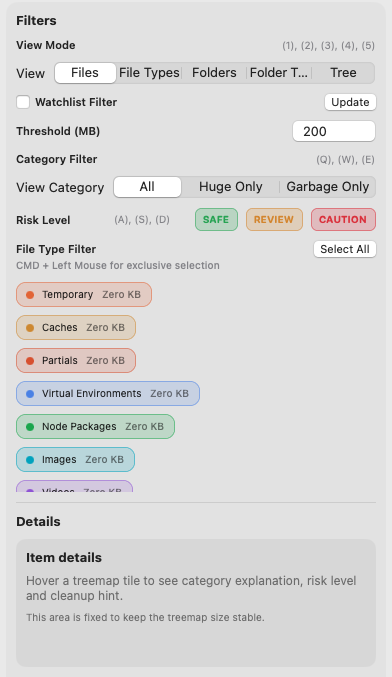
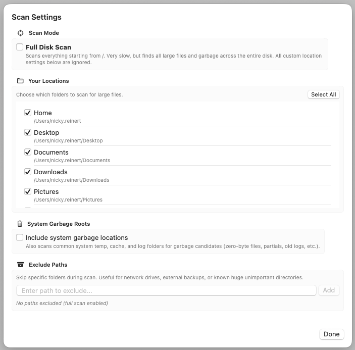
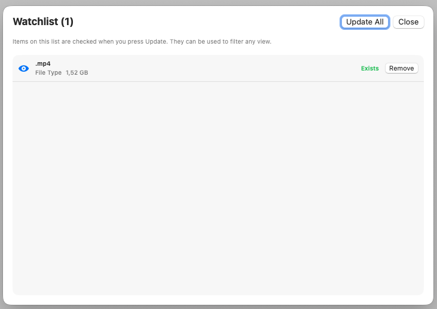
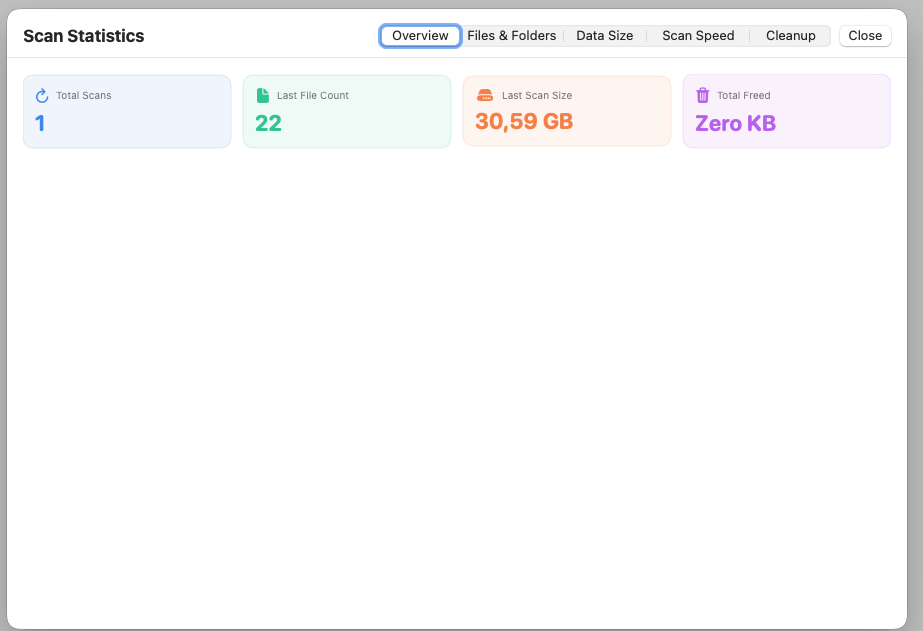
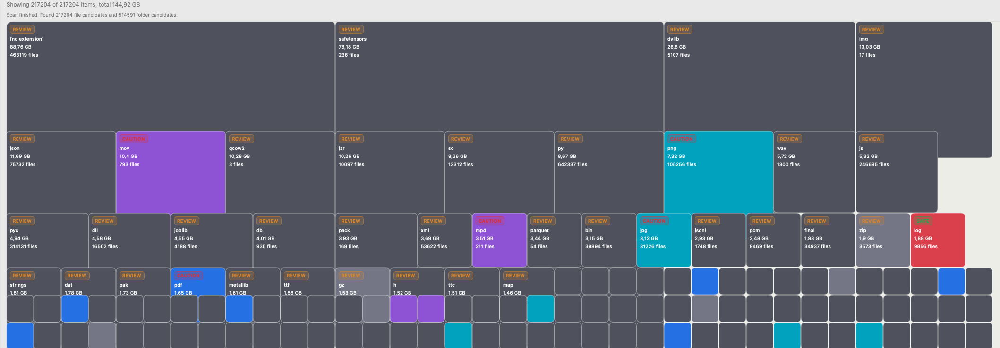

# DISK AUDIT

## Features

- scans all your files and folders
- provides different kind of views, always focussing on occupied disk space:
  - single huge files 
  - file types
  - folders
  - folder types (folders with the same name, e.g. ".env", "node_modules", "Downloads")
- a browsable tree view showing the file system structure and how big each node is
- filter the view to show huge files only or garbage files (e.g. "DS_Store", "Thumbs.db", "desktop.ini")
- quick filter by file or folder type (e.g. "Images", "Videos", "Documents")
- add files and folders to a "Deletion Queue" which gives you a quick shell command to delete them permanently 
- a journal that shows your historical deletions and the amount of freed disk space
- a history that keeps track of your scan actions
- a watchlist mode, that allows you to pin files or folders to see if they come back after you deleted them
- add items to an ignore list to not scan and show them again

## Prerequisites
- macOS 13 or newer
- Xcode Command Line Tools (Swift 5.9+)

## Build (CLI)
- Run in the project root: `swift build -c release`
- Output binary: `.build/release/DiskAuditApp`

## Deploy (Local .app Bundle)
- Run script: `./Scripts/build_app.sh`
- Result: `$HOME/Applications/DISK AUDIT.app`
- The script creates/updates `Info.plist`, copies the release binary, sets permissions, and includes the app icon.

## Launch
- Open the app in Finder under `~/Applications`
- Or launch directly: `open "$HOME/Applications/DISK AUDIT.app"`
